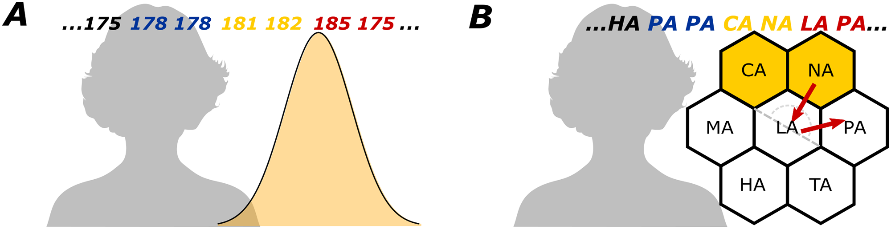
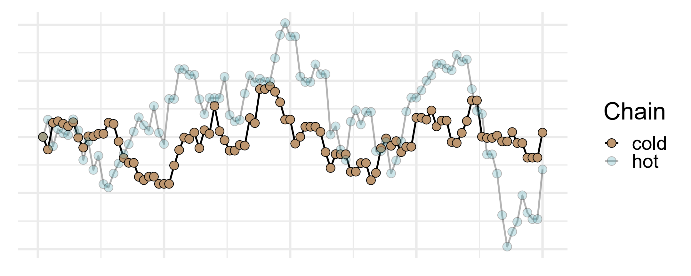
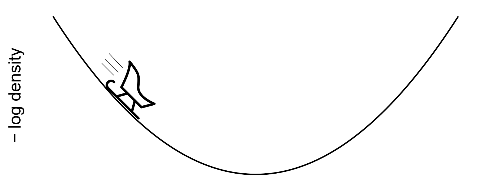
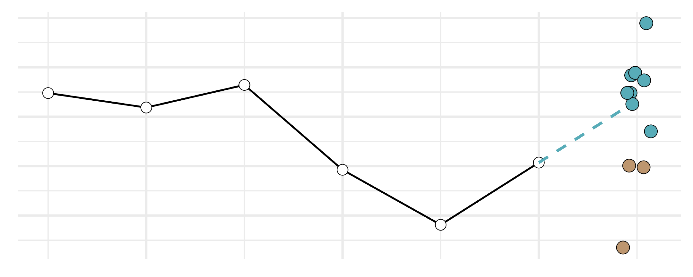
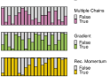
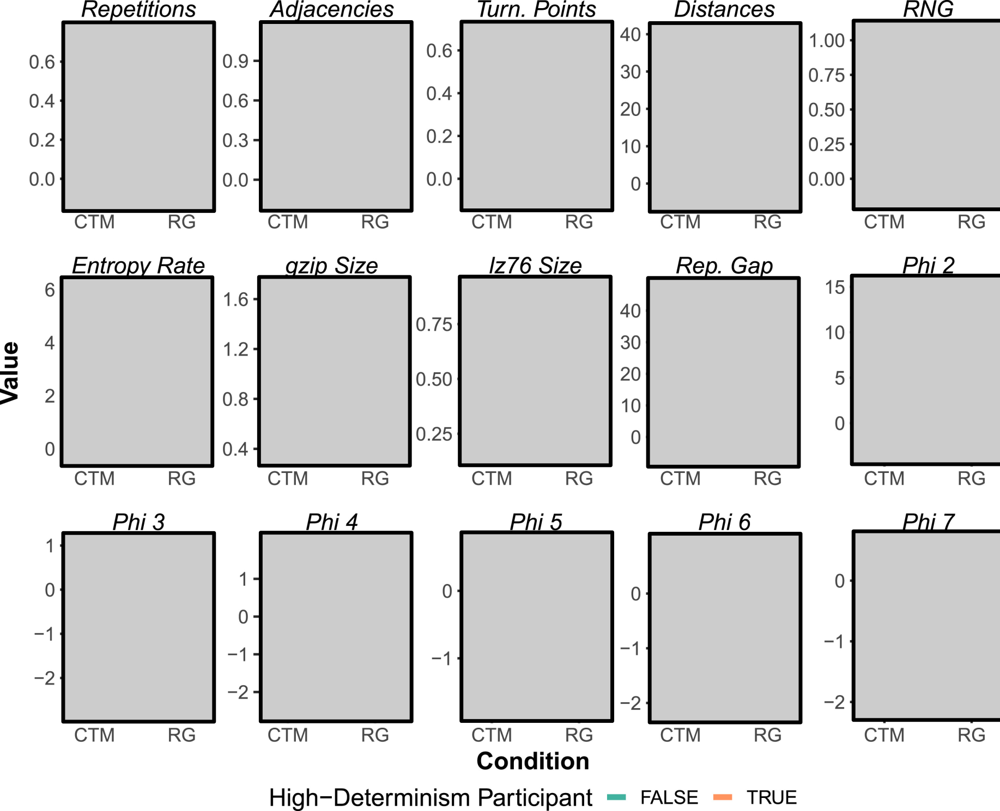
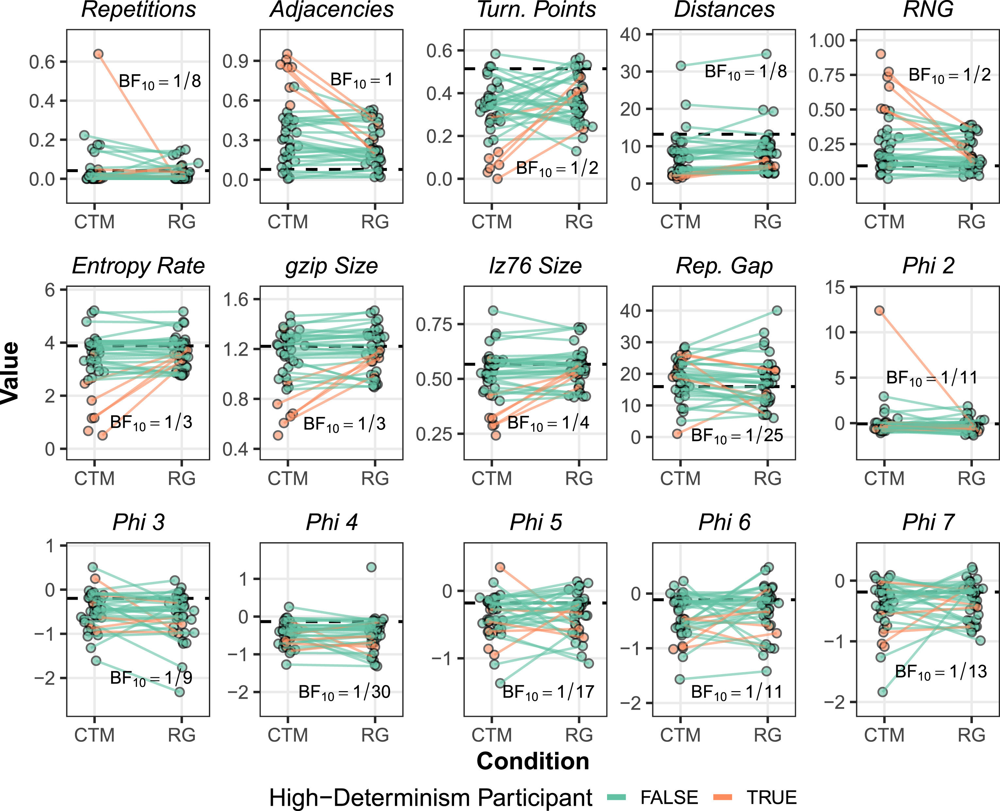

---
author:
  - name: Lucas Castillo
    affiliations: University of Warwick
  # - name: Stella C. Qian
  #   affiliations: University of Warwick
  # - name: Adam N. Sanborn
  #   affiliations: University of Warwick
title: Autocorrelated Sampling in Cognition
# subtitle: 
format:
  revealjs: 
    theme: [assets/style.scss]
    incremental: false
    self-contained: true
    width: 1600
    height: 900
    auto-stretch: true
    html-math-method:
      method: mathjax
      url: "https://cdn.jsdelivr.net/npm/mathjax@4/tex-mml-chtml.js"
# revealjs-plugins:
#   - editable
filters:
  - assets/invert-h1.lua
  - more-fragments
  - flourish
  - roughnotation
  # - editable
knitr:
  opts_chunk:
    dev: png
    dev.args: { bg: "transparent"}
execute: 
  cache: true
editor: source
mouse-wheel: false
history: false
code-block-border-left: true
bibliography: refs.bib
csl: apa.csl
editor_options: 
  chunk_output_type: console
---
```{r echo=F}
library(tidyverse)
library(samplr)
library(patchwork)
myTheme <- theme_minimal() + 
    theme(
      legend.position = "none", 
      axis.title = element_blank(), axis.text = element_blank(), 
      panel.grid = element_blank(), 
      panel.background = element_rect(fill="#eeeeee", colour="#eeeeee"),
      plot.background = element_rect(fill="#eeeeee", colour="#eeeeee")
      )
theme_set(myTheme)
```

## Optimal behaviour is hard

Human behaviour is similar to the Bayesian ideal

- in low-level domains such as vision [@yuille2006VisionBayesianInference]
- in high-level domains such as categorization [@xu2007WordLearningBayesian]

yet given existing constraints optimality is impossible.

::: {.fragment fragment-index="1"}
$$  p(H|D) = \frac{p(D|H)P(H)}{p(D)}$$
:::
::: {style="font-size:25"}

::: {.fragment fragment-index="2"}

:::

::: {.fragment fragment-index="3"}

:::
:::

## MCMC: The solution from computer science

::: {.columns}

::: {.column width="50%"}

::: {.incremental}
- Algorithms that draw directly from the posterior [@brooks2011HandbookMarkovChain]
- The way they sample avoids need for normalizing constant
- Trade-off: autocorrelated
- Metropolis-Hastings [@hastings1970MonteCarloSampling]:
  1. Start somewhere (set $x^0$)
  1. Propose a new sample ($x^t = x^{t-1} + n; n\sim\mathcal{N}(0, \sigma)$)
  1. Move there or not with $p = max(1, \Phi(x^t) / \Phi(x^{t-1}))$
  1. Go to 2

:::

:::

::: {.column width="50%"}
::: {.r-stack}


::: {.fragment}
```{r map, echo=F, fig.height=8}
library(samplr)
library(tidyverse)
set.seed(2)
hill_map <- plot_2d_density(
  start = c(-5,-5), size = 10, 
  cellsPerRow = 150, "mvnorm", list(c(0,0), diag(2))
) + myTheme + theme(legend.position="bottom")
hill_map
```

:::

::: {.fragment}

```{r, echo=F, fig.height=8}
samples <- samplr::sampler_mh(
  start = c(-2,-2), 
  distr_name = "mvnorm", 
  distr_params = list(c(0,0), diag(2)), sigma_prop = diag(2) * .01, 
  iterations = 500
  )$Samples
MH_df <- tibble(x=samples[,1], y = samples[,2])
hill_map + 
  geom_path(MH_df, mapping = aes(x,y), 
            colour = "red", linetype = "dashed", size = .5) + 
  geom_point(MH_df, mapping = aes(x,y), 
             colour = "white",size =.5) + theme(legend.position="bottom")
```

:::


:::
:::

:::

## MCMC in cognitive models

MCMC has been a successful explanation of behavioural phenomena across many domains:

::: {.incremental}
- @bruckner2025DifferencesLearningLifespan associate differences in learning across the lifespan with different number of samples drawn
- @lieder2018AnchoringBiasReflects relate the *anchoring bias* to starting point effects when few samples
- In @davis2020ProcessModelCausal, MCMC explains people's failures to integrate evidence into causal inferences
- ...
:::

## Many MCMC approaches
::: {.columns}

::: {.column width="50%"}
::: {.incremental}
- Computer science literature on MCMC is not a monolith
  - instead, many MCMC algorithms exist [(with different pros and cons)]{.fragment}
- MCMC algorithms can be described as having 'qualitative features'
:::
:::

::: {.column width="50%"}
::: {.r-stack}
::: {.fragment .fade-in-then-out}
```{r map2, options}
set.seed(1)
N <- 5
# Create a matrix with the means of 15 different Gaussians
names <- rep("mvnorm", N)
parameters <- list()
for (i in 1:N){
  parameters[[i]] <- list(runif(2) * 18 - 9, diag(2))
}

weights <- runif(N)
weights <- weights / sum(weights)

hill_map <- plot_2d_density(
  start = c(-14,-14), size = 28, 
  cellsPerRow = 150, names, parameters, weights
) + 
  theme(legend.position = "bottom")
hill_map
```
:::
::: {.fragment .fade-in-then-out}
```{r}
iterations = 2**10
MH <- sampler_mh(
  start = c(5,5), distr_name = names, distr_params = parameters, 
  sigma_prop = diag(2) / 8, iterations = iterations, weights = weights
)

MH_df <- data.frame(x = MH[[1]][,1], y = MH[[1]][,2])

hill_map + 
  geom_path(MH_df, mapping = aes(x,y), 
            colour = "red", linetype = "dashed", size = .3) + 
  geom_point(MH_df, mapping = aes(x,y), 
             colour = "white",size =.1) +
  theme(legend.position = "bottom")
```
:::
::: {.fragment}
```{r}
iterations = 2**10
MC3 <- sampler_mc3(
  start = c(5,5), distr_name = names, distr_params = parameters, 
  sigma_prop = diag(2) / 8, iterations = iterations, weights = weights
)

MC3_df <- data.frame(x = MC3[[1]][,1,1], y = MC3[[1]][,2,1])

hill_map + 
    geom_path(MH_df, mapping = aes(x,y), 
            colour = "red", linetype = "dashed", size = .3) + 
    geom_point(MH_df, mapping = aes(x,y), 
             colour = "white",size =.1) +
    geom_path(MC3_df, mapping = aes(x,y), 
            colour = "yellow", linetype = "dashed", size = .3) + 
  geom_point(MC3_df, mapping = aes(x,y), 
             colour = "white",size =.1) +
  theme(legend.position = "bottom")
```
:::
:::
:::
:::


## Which MCMC algorithm are people using?
::: {.center}
::: {style = "width:50%"}
{fig-align="center"}

:::
:::


# Random Generation

## The Random Generation Paradigm
::: {.columns}

::: {.column width="50%"}
In @castillo2024ExplainingFlawsHuman, we evaluated this directly: 

::: {.incremental}
- We used the random generation paradigm [@baddeley1966CapacityGeneratingInformation; @chapanis1953RandomnumberGuessingBehavior]: asking participants to sample directly.

- We compared properties of their random sequences with those from different sampling algorithms.  
:::
:::

::: {.column width="50%"}
::: {.r-stack}
::: {.fragment .fade-in-then-out}
Multiple Chains

:::
::: {.fragment .fade-in-then-out}
Gradient-based Proposals

:::
::: {.fragment .fade-in-then-out}
Autocorrelated Proposals

:::


::: {.fragment}
| Sampler | Multiple Chains | Gradient-based Proposals | Autocorrelated Proposals |
|---------|-----------------|--------------------------|--------------------------|
| MH      | n               | n                        | n                        |
| MC3     | y               | n                        | n                        |
| HMC     | n               | y                        | n                        |
| [RECMH]{.rn-fragment rn-type=strike-through rn-color=red rn-strokeWidth=3}   | n               | n                        | y                        |
| MCHMC   | y               | y                        | n                        |
| [RECMC$^3$]{.rn-fragment rn-type=strike-through rn-color=red rn-strokeWidth=3}  | y               | n                        | y                        |
| REC     | n               | y                        | y                        |
| MCREC   | y               | y                        | y                        |
:::
:::
:::

:::


## Multiple Chains

::: {.columns}

::: {.column width="50%"}
### The basic idea
::: {.fragment fragment-index=1}
Have more than one chain running at the same time [@geyer1991MarkovChainMonte]
:::
::: {.fragment fragment-index=3}
Other chains have higher temperature (more likely to accept)
:::
::: {.fragment fragment-index=4}
Sometimes chains swap positions (if the colder of the two is "happy" with the new place)
:::
:::

::: {.column width="50%"}
```{r}
set.seed(1)
names <- rep("mvnorm", 2)
parameters <- list(
  list(c(-4, -4), diag(2)),
  list(c(4, 4), diag(2))
)

hill_map <- plot_2d_density(
  start = c(-9,-9), size = 20, 
  cellsPerRow = 150, names, parameters
)

MH <- sampler_mh(
  start = c(-3,-0), distr_name = names, distr_params = parameters, 
  sigma_prop = diag(2) / 8
)$Samples

MH_df <- data.frame(MH)
colnames(MH_df) <- c("x", "y")

MC3 <- sampler_mc3(
  start = c(-3,-0), distr_name = names, distr_params = parameters, 
  sigma_prop = diag(2) / 8, nChains = 10
)$Samples[,,1]

MC3_df <- data.frame(MC3)
colnames(MC3_df) <- c("x", "y")

```

::: {.r-stack}

::: {.fragment .fade-in-then-out fragment-index=1}

:::

::: {.fragment .fade-in-then-out fragment-index=3}
```{r}
expand_grid(
  x = seq(-2, 2, .01),
  chain = 1:4
) %>% 
  mutate(beta = 1/chain) %>% 
  mutate(y = dnorm(x)**beta) %>% 
  group_by(chain) %>% 
  mutate(y = y / sum(y)) %>% 
  ggplot(aes(x, y, colour=factor(chain))) + 
  geom_line(aes(group=factor(chain)), linewidth = 1.5) + 
  theme(
    legend.position = "bottom", 
    legend.text = element_text(size=15), 
    legend.title = element_text(size=20)
  ) + 
  guides(
    colour=guide_legend(title = "Chain", override.aes = list(linewidth=2))
  )
```
:::


::: {.fragment .fade-in-then-out fragment-index=6}

```{r}
#| fig-height: 8
hill_map + theme(legend.position = "none")
```

:::
::: {.fragment .fade-in-then-out fragment-index=7}

```{r}
#| fig-height: 8
hill_map +
  geom_path(MH_df, mapping = aes(x,y),
            colour = "red", linetype = "dashed", size = .3) +
  geom_point(MH_df, mapping = aes(x,y),
             colour = "white",size =.1) + theme(legend.position = "none")
```
:::

::: {.fragment fragment-index=8}

```{r}
#| fig-height: 8
hill_map +
  geom_path(MC3_df, mapping = aes(x,y),
            colour = "yellow", linetype = "dashed", size = .3) +
  geom_point(MC3_df, mapping = aes(x,y),
             colour = "white",size =.1) + theme(legend.position = "none")

```
:::

:::
:::

:::


## Gradient-based proposals
```{r hmc-setup}
hill_map <- plot_2d_density(
  start = c(-3, -3), 
  size = 6, 
  cellsPerRow = 150, 
  names = "mvnorm", params = list(c(0,0), diag(2))
) + theme(legend.position = "none")

f <- \(x){mvtnorm::dmvnorm(x, c(0,0), diag(2), log = T)}
source("assets/hmc_funcs.R")

set.seed(1)
start <- c(-1, -1)

points <- tibble(x = start[1], y = start[2])

draw_points <- function(){
  hill_map + 
    geom_point(data=points, aes(x,y), size=3)
}

draw_momentum <- function(){
  draw_points() + 
    geom_segment(
      x=start[1], xend=start[1] + momentum[1],
      y=start[2], yend=start[2] + momentum[2], 
      arrow=arrow(length = unit(0.03, "npc"))
    )
}
make_trajectory <- function(){
  thetas <<- leapfrog_step(start, momentum, .1, 10, f)  
}
draw_trajectory <- function(){
  hill_map + 
    geom_path(data = tibble(x=thetas[,1], y=thetas[,2]), aes(x=x, y=y), colour="grey") + 
    geom_point(data = tibble(x=thetas[,1], y=thetas[,2]), aes(x=x, y=y), colour = "grey") +
    geom_point(data=points, aes(x,y), size=3)
}

update_points <- function(){
  points <<- bind_rows(
    points, 
    tibble(x = thetas[11, 1], y = thetas[11, 2])
  )
}

update_start <- function(){
  start <<- thetas[11,]
}
update_momentum <- function(){
  momentum <<- rnorm(2)
}
```

::: {.columns}

::: {.column width="50%"}
### The basic idea

::: {.fragment fragment-index=1}
Don't make "blind" proposals, but base them on the gradient of the target density [@neal2011MCMCUsingHamiltonian]
:::

::: {.fragment fragment-index=2}
This increases acceptance rate without being stuck in a location.
:::

::: {.fragment fragment-index=3}
Achieved by simulating a physical system with random momentum in each iteration.
(simulate $L$ steps of size \[precision\] $\epsilon$)
:::

:::

::: {.column width="50%"}
::: {.r-stack}
::: {.fragment .fade-out fragment-index=4}
::: {.fragment fragment-index=1}

:::
:::

::: {.fragment fragment-index=4}
```{r}
#| fig.height: 8
draw_points()
```
:::
::: {.fragment fragment-index=5}
```{r}
#| fig.height: 8
update_momentum()
draw_momentum()
```
:::
::: {.fragment fragment-index=6}
```{r}
#| fig.height: 8
make_trajectory()
draw_trajectory()
```
:::
::: {.fragment fragment-index=7}
```{r}
#| fig.height: 8
update_points()
draw_points()
```
:::
::: {.fragment fragment-index=8}
```{r}
#| fig.height: 8
update_start()
update_momentum()
draw_momentum()
```
:::
::: {.fragment fragment-index=9}
```{r}
#| fig.height: 8
make_trajectory()
draw_trajectory()
```
:::
::: {.fragment fragment-index=10}
```{r}
#| fig.height: 8
update_points()
draw_points()
```
:::
::: {.fragment fragment-index=11}
```{r}
#| fig.height: 8
update_start()
update_momentum()
draw_momentum()
```
:::
::: {.fragment fragment-index=12}
```{r}
#| fig.height: 8
make_trajectory()
draw_trajectory()
```
:::
::: {.fragment fragment-index=13}
```{r}
#| fig.height: 8
update_points()
draw_points()
```
:::
::: {.fragment fragment-index=14}
```{r}
#| fig.height: 8
update_start()
update_momentum()
draw_momentum()
```
:::
::: {.fragment fragment-index=15}
```{r}
#| fig.height: 8
make_trajectory()
draw_trajectory()
```
:::
::: {.fragment fragment-index=16}
```{r}
#| fig.height: 8
update_points()
draw_points()
```
:::
::: {.fragment fragment-index=17}
```{r}
#| fig.height: 8
update_start()
update_momentum()
draw_momentum()
```
:::
::: {.fragment fragment-index=18}
```{r}
#| fig.height: 8
make_trajectory()
draw_trajectory()
```
:::
::: {.fragment fragment-index=19}
```{r}
#| fig.height: 8
update_points()
draw_points()
```
:::
::: {.fragment fragment-index=20}
```{r}
#| fig.height: 8
update_start()
update_momentum()
draw_momentum()
```
:::
::: {.fragment fragment-index=21}
```{r}
#| fig.height: 8
make_trajectory()
draw_trajectory()
```
:::
::: {.fragment fragment-index=22}
```{r}
#| fig.height: 8
update_points()
draw_points()
```
:::
:::
:::

:::


## Autocorrelated proposals
::: {.columns}

::: {.column width="50%"}
::: {.fragment fragment-index=1}
In MH, 

- $\theta^{t'} = \theta^{t-1} + n; n \sim \mathcal N (0, \sigma)$

In Gradient-based proposals:

- $\rho \sim \mathcal N (0, 1)$
:::
::: {.fragment fragment-index=2}
This can lead to random-walk behaviour which is inefficient sometimes
:::
::: {.fragment fragment-index=5}
Instead, recycle the previous jump to get a sense of trajectory.
:::

::: {.fragment}
[@horowitz1991GeneralizedGuidedMonte]
:::
:::

::: {.column width="50%"}
::: {.r-stack}
::: {.fragment .fade-in-then-out fragment-index=2}
```{r}
#| fig.height: 8
mu <- c(0,0)
sigma <- matrix(c(1,.9, .9, 1), ncol = 2)
hill_map <- plot_2d_density(
  start = c(-3, -3), 
  size = 6, 
  cellsPerRow = 150, 
  names = "mvnorm", params = list(mu, sigma)
) + theme(legend.position = "none")
hill_map
```
:::
::: {.fragment .fade-in-then-out fragment-index=3}
```{r}
#| fig.height: 8
set.seed(1)
mh <- sampler_mh(
  c(1, 1), 
  "mvnorm", 
  list(mu, sigma), 
  sigma_prop = diag(2)*.001, alpha = 0
  )$Samples

mh <- tibble(x=mh[,1], y=mh[,2])

hill_map + 
  geom_path(data=mh, aes(x,y))
```

:::
::: {.fragment .fade-in-then-out fragment-index=4}
```{r}
#| fig.height: 8
set.seed(1)
mh2 <- sampler_mh(
  c(1, 1), 
  "mvnorm", 
  list(mu, sigma), 
  sigma_prop = diag(2)*.001, alpha = .5
)$Samples

mh2 <- tibble(x=mh2[,1], y=mh2[,2])

hill_map + 
  geom_path(data=mh2, aes(x,y))
```
:::

::: {.fragment .fade-in-then-out fragment-index=6}
```{r}
#| fig.height: 8
alpha_recycle <- function(last, alpha){
  ret <- c()
  for (i in 1:length(last)){
    ret[i] <- alpha * last[i] + sqrt(1 - alpha**2) * rnorm(1)
    
  }
  ret  
}
t(sapply(1:1000, \(x){alpha_recycle(c(1,0), 0)})) %>% 
  magrittr::set_colnames(c("x", "y")) %>% 
  ggplot() + 
  xlim(-3, 3) + 
  ylim(-3, 3) +
  geom_segment(x=-1, xend=0, y=0, yend=0, arrow=arrow(length = unit(0.4,"cm")), linewidth=2, color="red") +
  labs(caption = "Previous jump") + theme(plot.caption = element_text(size=20))

```
:::
::: {.fragment .fade-in-then-out fragment-index=7}
```{r}
#| fig.height: 8
set.seed(1)
t(sapply(1:1000, \(x){alpha_recycle(c(1,0), 0)})) %>% 
  magrittr::set_colnames(c("x", "y")) %>% 
  ggplot() + 
  xlim(-3, 3) + 
  ylim(-3, 3) +
  geom_segment(aes(xend=x, yend=y), x=0, y=0, arrow=arrow(length = unit(0.1,"cm")), alpha=.1) + 
  geom_segment(x=-1, xend=0, y=0, yend=0, arrow=arrow(length = unit(0.4,"cm")), linewidth=2, color="red") +
  labs(caption = "\u03b1 = 0")+ theme(plot.caption = element_text(size=20))

```
:::
::: {.fragment fragment-index=8}
```{r}
#| fig.height: 8
set.seed(1)
t(sapply(1:1000, \(x){alpha_recycle(c(1,0), 0.75)})) %>% 
  magrittr::set_colnames(c("x", "y")) %>% 
  ggplot() + 
  xlim(-3, 3) + 
  ylim(-3, 3) +
  geom_segment(aes(xend=x, yend=y), x=0, y=0, arrow=arrow(length = unit(0.1,"cm")), alpha=.1) + 
  geom_segment(x=-1, xend=0, y=0, yend=0, arrow=arrow(length = unit(0.4,"cm")), linewidth=2, color="red") +
  labs(caption = "\u03b1 = .75")+ theme(plot.caption = element_text(size=20))

```
:::
:::
:::

:::

## Results
::: {.r-stack}
::: {.fragment .fade-in-then-out}
```{r}
df <- samplrData::castillo2024.rgmomentum.e1 %>% 
  filter(target_dist == "N") %>% 
  group_by(id) %>% 
  summarise(across(R:expected_D, \(x){mean(x, na.rm=T)})) %>% 
  pivot_longer(R:expected_D) %>% 
  mutate(expected = str_detect(name, "expected")) %>% 
  mutate(name = str_remove(name, "expected_")) %>% 
  pivot_wider(values_from = value, names_from = name)
df %>% 
  filter(!expected) %>% 
  select(-S) %>% 
  pivot_longer(R:D) %>% 
  ggplot(aes(name, value)) + 
  ggbeeswarm::geom_quasirandom(alpha=0) +
  facet_wrap(vars(name), scales="free", ncol=4) +
  geom_hline(
    data = df %>% summarise(across(R:D, mean)) %>% pivot_longer(everything()),
    aes(yintercept = value)
  ) + 
  theme_minimal(20)

```
:::

::: {.fragment .fade-in}
```{r}
df <- samplrData::castillo2024.rgmomentum.e1 %>% 
  filter(target_dist == "N") %>% 
  group_by(id) %>% 
  summarise(across(R:expected_D, \(x){mean(x, na.rm=T)})) %>% 
  pivot_longer(R:expected_D) %>% 
  mutate(expected = str_detect(name, "expected")) %>% 
  mutate(name = str_remove(name, "expected_")) %>% 
  pivot_wider(values_from = value, names_from = name)
df %>% 
  filter(!expected) %>% 
  select(-S) %>% 
  pivot_longer(R:D) %>% 
  ggplot(aes(name, value)) + 
  ggbeeswarm::geom_quasirandom() +
  facet_wrap(vars(name), scales="free", ncol=4) +
  geom_hline(
    data = df %>% summarise(across(R:D, mean)) %>% pivot_longer(everything()),
    aes(yintercept = value)
  ) + 
  theme_minimal(20)

```
:::
:::

@castillo2024ExplainingFlawsHuman

## Modelling Results
::: {.r-stretch}
{style="height:50%;fig-align:center"}
:::

::: {.fragment}

::: {.absolute width=400px height=50px left=562.1px top=230.1px}

Autocorrelated Proposals

:::



:::


## Is it the same process?
::: {.incremental}
- In @castillo2024ExplainingFlawsHuman we find that a model with all qualitative features explains people's generations best. 
- Question remains: is this the same process as sampling 'in real life'?
  - most random generation theories postulate specific processes to the task that wouldn't translate to other domains [@cooper2016ExecutiveFunctionsGeneration;@jahanshahi1998EffectsTranscranialMagnetic]
- In @castillo2026RandomGenerationWhat we asked the same participants to
  - do random generation, or
  - say heights as they come to mind [(counterbalanced)]{.fragment}
:::

## Results
::: {.columns}
::: {.column width="50%"}
::: {.r-stack}
::: {.fragment}

:::
::: {.fragment}

:::
:::
:::

::: {.column width="50%"}
::: {.fragment}
Same model that best fits people in the random generation task fits people best in the comes-to-mind task
:::
:::

:::


# Autocorrelated Sampling at Home

## MCMC as part of cognitive model
::: {.center}
::: {style = "width:50%"}
{fig-align="center"}
:::
:::

::: {.fragment}

::: {.incremental}
For example: in @bruckner2025DifferencesLearningLifespan participants:

1. Observe new evidence
1. [Sample a chunk of samples from posterior]{.red}
1. Evaluate whether sample mean different from initial belief
1. If so, update beliefs and go to 2, otherwise discard samples

:::
:::


## The `samplr` package
::: {.columns}
::: {.column}
::: {style="height:100px"}
::: {.fragment}
```{r, echo=T, eval=F}
#| code-line-numbers: "1|3-7|2|8-9"
samplr::sampler_mh(
  start = c(-2,-2), 
  distr_name = "mvnorm", 
  distr_params = list(
    c(0,0), 
    diag(2)
  ), 
  sigma_prop = diag(2) * .01, 
  iterations = 500
  )$Samples
```
:::
:::
:::

::: {.column width="50%"}
::: {.fragment}

```{r}
set.seed(2)
hill_map <- plot_2d_density(
  start = c(-5,-5), size = 10, 
  cellsPerRow = 150, "mvnorm", list(c(0,0), diag(2))
) + theme(legend.position="bottom")
samples <- samplr::sampler_mh(
  start = c(-2,-2), 
  distr_name = "mvnorm", 
  distr_params = list(c(0,0), diag(2)), sigma_prop = diag(2) * .01, 
  iterations = 500
  )$Samples
MH_df <- tibble(x=samples[,1], y = samples[,2])
hill_map + 
  geom_path(MH_df, mapping = aes(x,y), 
            colour = "red", linetype = "dashed", size = .5) + 
  geom_point(MH_df, mapping = aes(x,y), 
             colour = "white",size =.5) + theme(legend.position="bottom")
```
:::

::: {.fragment}
::: {.callout-note}
### Offerings of the package
- 8 MCMC algorithms with/without 3 qualitative features
- Cognitive model that incorporates MCMC sampling [ABS, @zhu2024AutocorrelatedBayesianSampler]
- Diagnostic functions that can help distinguish between models
:::
:::
:::
:::


::: {.fragment .absolute bottom="0" left="0"}
[https://lucas-castillo.github.io/samplr/](https://lucas-castillo.github.io/samplr/)
:::


## The `samplr` package
::: {.aspect-ratio-box style="position: relative; width: 100%; height: 0; padding-bottom: 56.25%;"}
```{=html}
<iframe src="https://lucas-castillo.github.io/samplr/" data-external="1" style="position: absolute; top: 0; left: 0; width: 100%; height: 100%; border: none;"></iframe>
```
:::


## The `samplr` package
::: {.columns}

::: {.column width="50%"}
Preprint (under review at [Behavior Research Methods]{.red}):

::: {.incremental}

- How to use the package
- How to fit MCMC models to data

:::
:::

::: {.column width="50%"}
[View PDF](https://osf.io/preprints/psyarxiv/ax8hm_v2){target="_blank"}
:::

:::


::: {.absolute bottom="0" left="0"}
@castillo2025SamplrPackageTool
:::

## Take home message
::: {.incremental}
- MCMC sampling is a successful approach to modelling cognition
- Using random generation, we can identify which sampler the mind uses
- Applying MCMC to your models is easier than ever with the `samplr` package
:::

## Thank you

::: {layout-ncol=6 style="font-size:.65em"}
#### Pablo León-Villagrá
{width=80%}

#### Johanna K Falbén
{width=80%}

#### Yun-Xiao Li
{width=80%}

#### C. Stella Qian
{width=80%}

#### Nick Chater
{width=80%}

#### Adam N. Sanborn
{width=100%}
:::


{width=200px}

{width=200px}

# Thank you!

## Some links {style="font-size:.75em"}
::: {.columns}

::: {.column width="30%"}
Link to these slides

:::

::: {.column width="30%"}
Link to `samplr` package paper

:::
::: {.column width="30%"}
Link to random generation paper

:::

:::


## References

::: {#refs}
:::

<!-- ## This is another slide -->

<!-- with some more [text]{.rn-fragment rn-type=underline rn-color=red} -->

<!-- # New Section -->

<!-- ## Code Slide -->

<!-- ::: {.columns} -->

<!-- ::: {.column width="50%"} -->

<!-- ```{r, echo=T, eval=F} -->

<!-- #| flourish: -->

<!-- #|   - target: "mean" -->

<!-- #|     style: "--rn-type: circle; --rn-color: red;" -->

<!-- x <- c(1, 2, 3, 4, 5) -->

<!-- mean(x) -->

<!-- ``` -->

<!-- ::: -->

<!-- ::: {.column width="50%"} -->

<!-- ```{r} -->

<!-- mean(1:5) -->

<!-- ``` -->

<!-- ::: -->

<!-- ::: -->

<!-- ## Code 2 -->

<!-- ```{r, echo=T, eval=F} -->

<!-- #| flourish: -->

<!-- #|   - target: "mean" -->

<!-- #|     style: "--rn-type: circle; --rn-color: red;" -->

<!-- x <- c(1, 2, 3, 4, 5) -->

<!-- mean(x) -->

<!-- ``` -->

<!-- ## Snippets -->

<!-- I've defined the following snippets -->

<!--   - [`tf`]{.rn-fragment rn-type=underline rn-color=red} for text flourish -->

<!--   - [`cf`]{.rn-fragment rn-type=underline rn-color=red} for code flourish -->

<!--   - `::` for quarto div -->

<!--   - `col` for 2-column environment -->

<!-- $$ -->
<!-- p(H|D) = \frac{% -->
<!--     \data{rn-color=#F2D541}{\class{rn-fragment fragment}{p(D|H)P(H)}} -->
<!--     }{% -->
<!--       \data{rn-color=#F2D541}{\class{rn-fragment fragment}{p(B)}} -->
<!-- } -->
<!-- $$ -->
